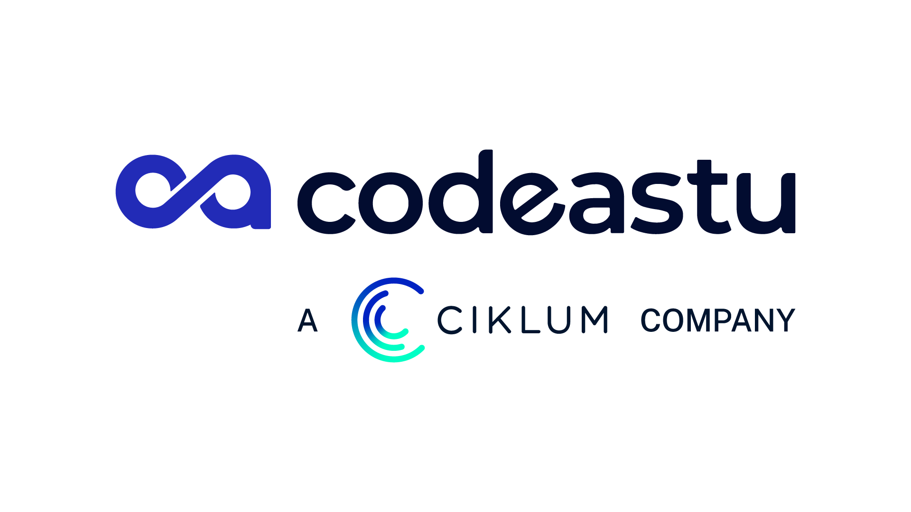

# **Microtasks vs. Macrotasks**
---

### **Microtasks**

- Higher priority tasks.
- Executed immediately after the current synchronous code finishes, before macrotasks.

Examples:

- Promise.then / catch / finally
- queueMicrotask()
- MutationObserver

---

### **Macrotasks**

- Lower priority, executed after all microtasks finish.

Examples:

- setTimeout
- setInterval
- setImmediate (Node.js)
- I/O operations
- requestAnimationFrame

---

### **Execution Order**

- Run synchronous code (call stack).
- Run all microtasks.
- Run one macrotask.
- Repeat the cycle.
---
#### **Real-Time Example**

```.js
console.log("1: Start");

setTimeout(() => {
  console.log("2: setTimeout (Macrotask)");
}, 0);

Promise.resolve().then(() => {
  console.log("3: Promise (Microtask)");
});

console.log("4: End");
```
---
**Output:**
```.js
1: Start
4: End
3: Promise (Microtask)
2: setTimeout (Macrotask)
```

**Why this order?**

- console.log("1") and console.log("4") run synchronously.
- Promise.then (microtask) runs **before** setTimeout (macrotask), even if timeout is 0.8

---

### **Real-Time Example in Apps**
**Example: Showing a loader while fetching data**

```.js
console.log("Show loader");

fetch("/api/data") // async task → macrotask
  .then(() => {
    console.log("Data fetched"); // microtask
  });

console.log("Continue rendering UI");
```
---
**Output:**
```.js
Show loader
Continue rendering UI
Data fetched
```
